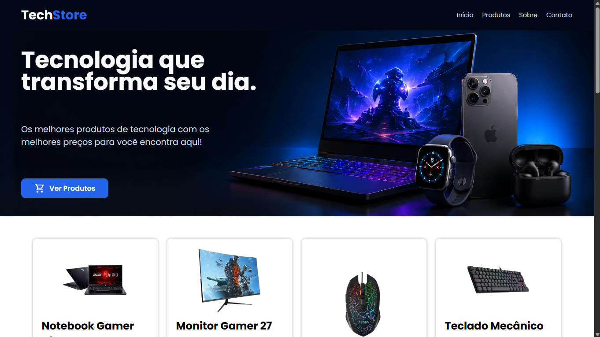

# 🛒 TechStore

Projeto de e-commerce fictício desenvolvido como atividade do curso Fullstack da **+PraTi**.

O projeto simula uma loja de tecnologia com listagem dinâmica de produtos, modal de detalhes e busca de endereço via API de CEP.

---
## Preview do Projeto



---

## 🌐 Visualizar o projeto

👉 [Acessar o projeto online](https://SEU-USUARIO.github.io/techstore-site/)

---

## 🚀 Funcionalidades

- Listagem dinâmica de produtos com JavaScript
- Modal com detalhes completos do produto
- Exibição de preço formatado
- Consulta de endereço via API ViaCEP
- Notificações com Toastify
- Interface responsiva

---

## 🧰 Tecnologias utilizadas

- HTML5  
- CSS3  
- JavaScript (ES Modules)  
- API ViaCEP  
- Toastify JS  
- Google Fonts  
- Font Awesome  
- Material Symbols  

---

## 📁 Estrutura do projeto

```

techstore/
├── assets/
│   ├── css/
│   │   ├── global.css
│   │   ├── cabecalho.css
│   │   ├── inicio.css
│   │   ├── produtos.css
│   │   ├── sobre-contato.css
│   │   ├── footer.css
│   │   └── modal.css
│   │
│   ├── js/
│   │   ├── script.js
│   │   └── produtos.js
│   │
│   └── img/
│       └── (imagens do projeto)
│
└── index.html

````

---

## ⚙️ Principais funcionalidades

### 🛍️ Produtos
- Renderização dinâmica com `map()`
- Cards com imagem, nome, descrição e preço
- Botão "Ver Detalhes" abre modal

### 📦 Modal
- Exibe detalhes completos do produto
- Lista especificações dinamicamente
- Fecha ao clicar no X ou fora do modal

### 📍 Busca de CEP
- Consumo da API ViaCEP
- Preenchimento automático do endereço
- Validação de CEP (8 dígitos)
- Notificações de erro com Toastify

---

## 🎨 Layout

- Tema escuro com azul como cor principal
- Layout responsivo
- Uso de Flexbox e Grid
- Foco em experiência do usuário

---

## ▶️ Como executar o projeto

```bash
git clone https://github.com/elisvaldobraga23/techstore-site
````

Depois:

* Abra a pasta do projeto
* Abra o arquivo `index.html` no navegador

---

## 📚 Aprendizados

* Manipulação do DOM
* Consumo de APIs com fetch
* Organização de projeto frontend
* Componentização com CSS
* Eventos em JavaScript
* ES Modules

---

## 👨‍💻 Autor

Desenvolvido por **Elisvaldo Braga**
 - [LinkedIn](https://www.linkedin.com/in/elisvaldo/)
 - [Portfolio](https://elisvaldobragadev.netlify.app/ 
 )
---
Projeto acadêmico do curso Fullstack da +PraTi
